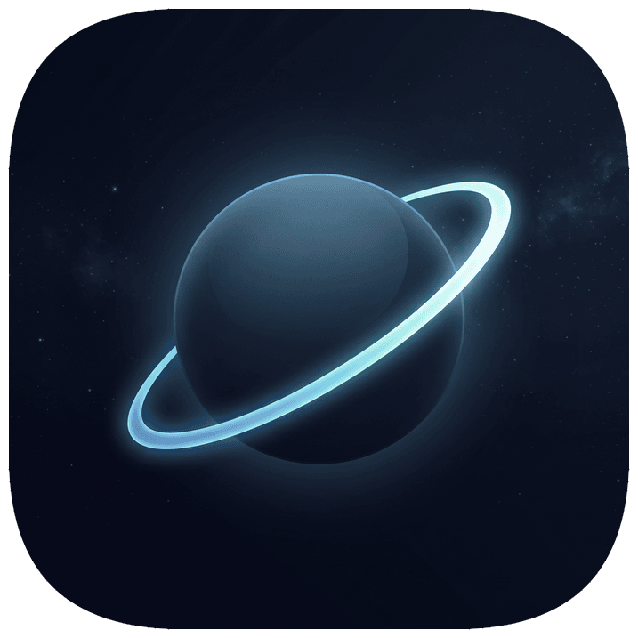
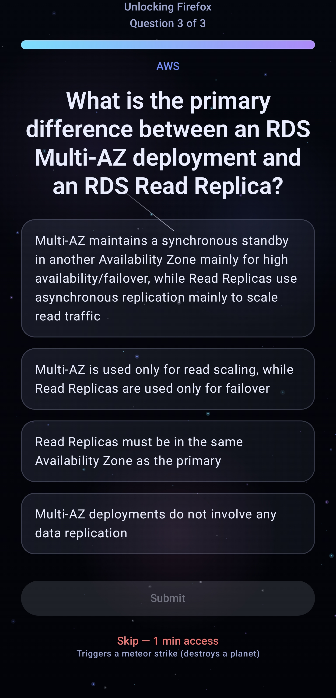

<div align="center">



# 🪐 Orbit

### Focus to grow your cosmos

<p>
  
  
  
  
  
</p>


</div>

## About

Orbit is a personal project of mine. It's a fully local single-user app blocker for Android, built for my Samsung Galaxy S24+.

I made it with the goal of spending less time on my phone so I can study more and/or touch grass.

## How it works

When you open a blocked app, Orbit intercepts it and asks you quiz questions before letting you in. Focus sessions grow an animated cosmos. Wrong answers trigger a meteor strike that sets you back. Noisy app notifications get sorted into tiers so only what matters reaches you. Quiz questions include the following topics: [software engineering, system design, AWS, chess].

<div align="center">

</div>

## Tech

- Kotlin + Jetpack Compose (Material 3)
- Room (database) and DataStore (settings)
- WorkManager (background cleanup)
- Hilt (dependency injection)
- Blocking via AccessibilityService, filtering via NotificationListenerService

## Build

```bash
git clone https://github.com/arturomaciaas/orbit.git
cd orbit

./gradlew assembleDebug     # build a debug APK
./gradlew installDebug      # install on a connected device
./gradlew testDebugUnitTest # run unit tests
```

Requirements: JDK 17, Android SDK 35, a device on Android 12+ (API 31).

## See the cosmos:

<div align="center">

</div>
